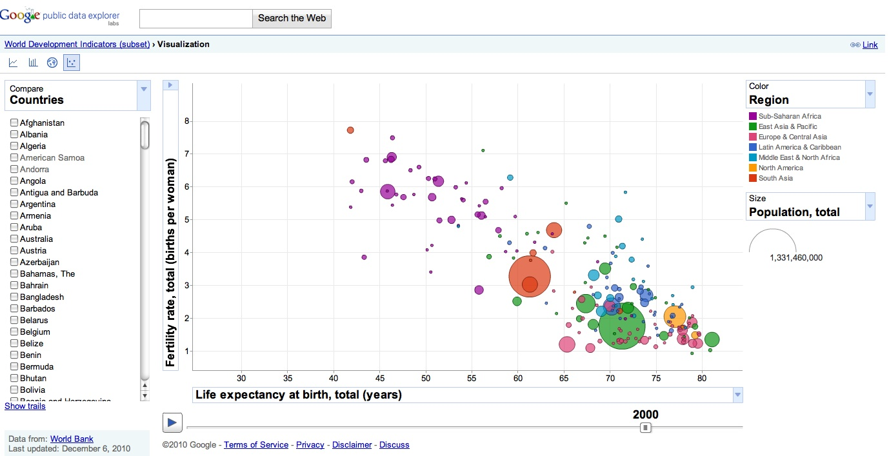
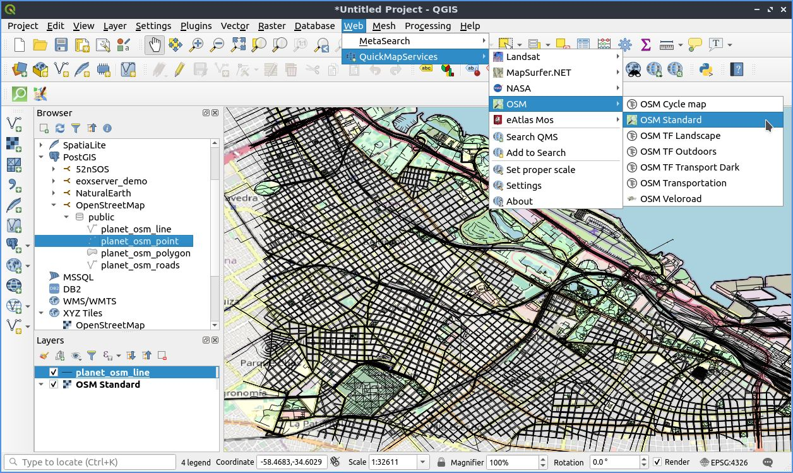

# Аналіз предметної області

## Вступ

*[Вступ повинен містити короткий огляд всього документу.]*

## Основні визначення

*[Розділ містить визначення термінів та скорочень, які використовуються при аналізі предметної області.]*

## Підходи та способи вирішення завдання

*[Розділ містить опис підходів, моделей та способів вирішення завдання.]*

## Порівняльна характеристика існуючих засобів вирішення завдання

### [Google Public Data Explorer](https://www.google.com/publicdata/directory)

**Google Public Data Explorer** — це інструмент, створений Google, який дозволяє користувачам знаходити, досліджувати та візуалізувати великі набори відкритих даних. Цей сервіс надає можливість створювати інтерактивні графіки, карти та діаграми на основі даних, що надходять від урядових установ, міжнародних організацій та дослідницьких інституцій.

### [Gapminder](https://www.gapminder.org)

**Gapminder** — це некомерційна організація, заснована шведським професором Гансом Рослінгом, з метою популяризації глобальної освіти через статистичні дані. Gapminder розробляє інструменти, які допомагають візуалізувати світові тренди в різних сферах, таких як здоров'я, економіка, демографія та соціальний розвиток. Gapminder відіграє важливу роль у популяризації наукових даних і використовується у навчальних закладах, наукових дослідженнях і медіа для аналізу глобальних трендів.

### [The World Bank DataBank](https://databank.worldbank.org)

**The World Bank DataBank** — це інтерактивний інструмент, створений Світовим банком для надання доступу до величезної кількості світових економічних та соціальних даних. Він дозволяє користувачам переглядати, аналізувати та завантажувати дані, що стосуються таких сфер, як розвиток, економіка, демографія, інфраструктура, освіта, охорона здоров'я, екологія тощо.

### [OpenStreetMap](https://www.openstreetmap.org)

**OpenStreetMap (OSM)** — це краудсорсингова платформа, що забезпечує вільний доступ до географічних даних усього світу. Проект був заснований у 2004 році Стівом Коастом, і з того часу став однією з найбільших відкритих географічних баз даних. OSM використовує колективний внесок добровольців, які збирають, редагують і додають географічні дані, такі як дороги, будівлі, річки, ландшафти, кордони тощо. Відкритість платформи дозволяє її широке використання в різних галузях — від мобільних додатків до досліджень і гуманітарної допомоги.

### [UNdata](https://data.un.org)

**UNdata** — це платформа, створена Статистичним відділом Організації Об'єднаних Націй (ООН) для надання доступу до різноманітних статистичних даних, що охоплюють численні галузі, зібрані з країн-членів ООН та міжнародних агентств. UNdata дозволяє дослідникам, аналітикам, журналістам і будь-кому зацікавленому отримувати доступ до важливої інформації для аналізу, планування та моніторингу глобальних і національних показників.

### Табличне порівняння

Критерії:
- 🟢 - функція реалізована
- 🟡 - функція реалізована частково або має певні недоліки
- ❌ - функція не реалізована

| Загальні вимоги | Конкретні вимоги | G.P.D.E. | Gapminder | DataBank | OpenStreetMap | UNdata |
|-------------|-------------|-------------|-------------|-------------|-------------|-------------|
| Functionality | Відповідність вимогам | 🟢 | 🟢 | 🟢 | 🟢 | 🟢 |
| | Інтеграція з іншими системами | 🟡 | 🟡 | 🟡 | 🟢 | 🟡 |
| | Безпека | 🟢 | 🟢 | 🟢 | 🟡 | 🟢 |
| | Візуалізація даних | 🟢 | 🟢 | 🟢 | 🟢 | 🟡 |
| Usability | Легкість навчання | 🟢 | 🟢 | 🟢 | 🟡 | 🟢 |
| | Підтримка багатьох мов | 🟡 | 🟡 | 🟢 | 🟢 | 🟢 |
| | Документація | 🟢 | 🟢 | 🟢 | 🟢 | 🟢 |
| | Інтуїтивний інтерфейс | 🟢 | 🟢 | 🟡 | 🟡 | 🟡 |
| Reliability | Точність результатів | 🟢 | 🟢 | 🟢 | 🟡 | 🟢 |
| | Стійкість до навантажень | 🟡 | 🟢 | 🟢 | 🟢 | 🟢 |
| | Відновлюваність | 🟢 | 🟢 | 🟢 | 🟢 | 🟢 |
| | Ліцензія | 🟢 | 🟢 | 🟢 | 🟢 | 🟢 |
| Performance | Швидкість виконання | 🟡 | 🟢 | 🟡 | 🟢 | 🟡 |
| | Масштабованість | 🟡 | 🟡 | 🟢 | 🟢 | 🟢 |
| Supportability | Зворотний зв'язок | 🟡 | 🟡 | 🟡 | 🟢 | 🟡 |
| | Оновлюваність | 🟢 | 🟢 | 🟢 | 🟢 | 🟢 |

## Висновки

*[Робляться висновки щодо доцільності розробки нової або модифікації існуючої інформаційної системи, необхідності та способів інтеграції з системами(сервісами) третіх сторін, тощо.]*

## Посилання

*[Розділ містить повний список всіх документів, про які згадується.]*
